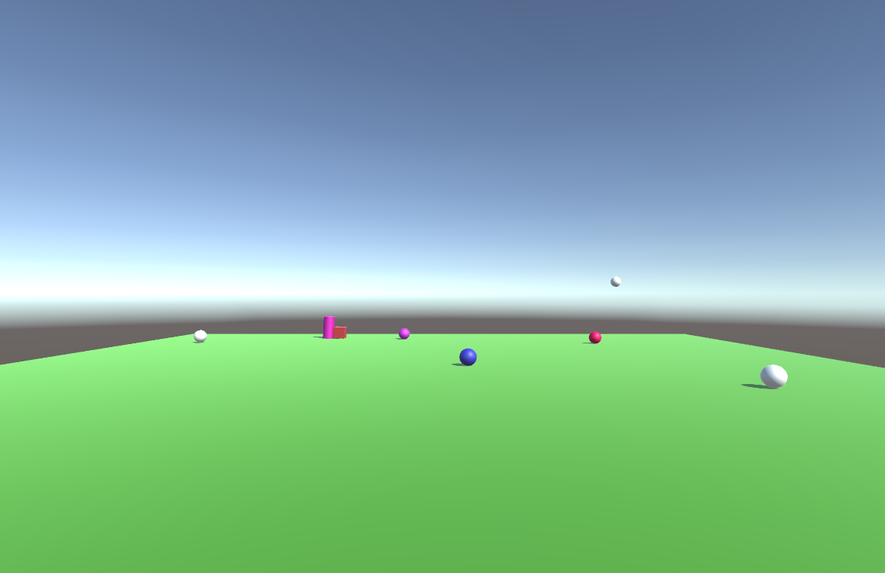
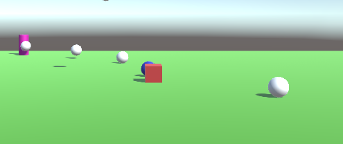
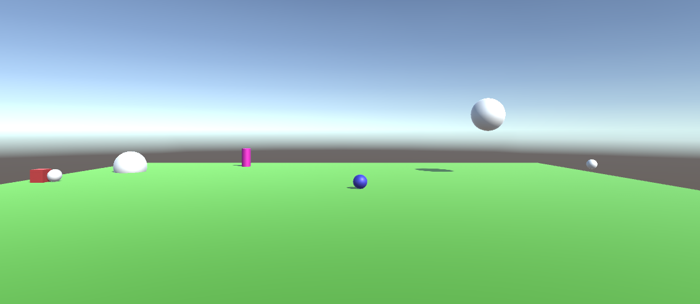

# Tarea4-Unity

La clase `Tarea4_Response` es para las esferas.

## Ejercicio 1 

Para ello he creado dos clases: Un `Tarea4_Notification` que detecta la colisión y envia el evento `OnCollisionEvent`.

En el otro clase `Tarea4_Response` , el evento está vinculado a un método de devolución de llamada:
`Tarea4_Notification.OnCollisionEvent += collisionEvent;` donde `collisionEvent` controla el comportamiento.

## Ejercicio 2

Es como el ejercicio anterior, pero ahora el metodo `OnCollisionEvent` es implementado en la clase del cubo `Tarea_4_MoveCube`.
El cubo envía dos eventos diferentes:
1. toca un elemento del grupo 1 `OnCollisionWithGroup1`
2. toca un elemento fuera del grupo 1 `OnCollisionNotFromGroup1`

También en la clase `Tarea4_Response` las esferas del Grupo 1 preste atención al evento `OnCollisionNotFromGroup1` y las esferas del grupo 2 al evento `OnCollisionWithGroup1`.

Aqui es un imagen cuando toca un objeto fuera del grupo 1, los esferas acercan el cilindro.

Y aqui es un imagen cuando toca un objeto del grupo 1, las esferas del grupo 2 aumentan de tamaño. 

## Ejercicio 3

### En la clase `Tarea_4_MoveCube`:

Con cada movimiento del cubo, se calcula la distancia al cilindro.
Si la distancia se reduce, se genera un evento `ApproachCylinder`.

### En la clase `Tarea4_Response`: 

Aqui tengo dos metodos diferentes para grupo 1 y grupo 2:
1. `ex3_reactionGroup1`: Cambiar el color y saltar (cambiar la posicion del eje z) cada 250 ms
2. `ex3_reactionGroup2`: movimiento hasta el nuevo objeto

